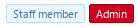

# Template syntax

The XenForo 2 template syntax is a powerful tool for both developers and forum administrators, giving you complete control over the layout of your XenForo pages.

## Best practices
- XenForo tags, by convention, are `lowercase`.
- All XenForo tags are prefixed with the `xf:` namespace.

## Useful information

### Commenting up your templates
If you want to comment out some template code (or an inspirational message) that you don't want viewable in the final page source, you can use the `xf:comment` tag.

```html
<xf:comment>
If you stop seeing the world in terms of what you like
and what you dislike and saw things for what they truly are in themselves,
you will find a great deal more peace in your life.
</xf:comment>
```

### Including another template in a template

The `xf:include` tag allows you to include a different template in your current template.

```html
<xf:include template="my_template" />
```

Simply set the `template  ` attribute to the name of the template you want to include.


## Template macros
Template macros are a very powerful aspect of the XenForo template syntax.

You should generally use a macro any place you would use a function or subroutine in a programming language.
For non-programmers, I'd summarize this as: **either** use a macro any place you want to produce the same thing multiple times in multiple different files **or** to produce something different under different circumstances (this would probably make more sense if you check the guide on defining a macro).

!!! warning
	For readability reasons, you should not use a macro tag as a variable. You should instead use the Set tag and treat the variable as you would any template variable.

### Defining a macro
```html
<xf:macro
    name="my_macro_name">

    <!-- Your macro content -->

</xf:macro>
```
At its simplest, a macro can be defined with a `name` attribute and the content you want repeated inside the macro tag.

!!! note
	When you're using a macro in multiple files, it's best practice to put the macro in it's own template.

#### Macro arguments
```html
<xf:macro
    name="my_macro_name"
    arg-message="My amazing macro message!">

    <h1>Message</h1>
    <p>{$message}</p>

</xf:macro>
```
In this example, a macro is defined with a default value for `arg-message` (`My amazing macro message!`).
This value would be overridden if the macro was called with the message argument.

Sometimes it's necessary to mark an argument as required. This can be done by setting the argument value to `!` in the macro definition.

### Including & using macros
```html
<xf:macro template="my_macro_template" name="my_macro_name" />
```
At it's simplest, you include a macro by setting the `name` attribute and leaving the tag empty.

!!! note
	When using a macro tag, you should use the self-closing form of the tag to allow someone to more easily distinguish the difference between a definition and usage of a macro.

#### Macro arguments
You can also provide arguments to the macro:

```html
<xf:macro template="my_macro_template" name="my_macro_name" arg-argName="argValue" />
```

Where `argName` is the name of the macro argument.

!!! note
	You should use `lowerCamelCase` for your macro argument names.

## Template control structures

The XenForo 2 template syntax supports certain control structures to make certain tasks easier to achieve.

### If tag

The if template tag can be used to conditionally display some HTML or a part of a template.

```html
<!-- Shows content only if a user is signed in... -->
<xf:if is="$xf.visitor.user_id">
	<!-- Do something... -->
</xf:if>
```

The if tag takes the following attributes:

- `is` - The condition which, when met, the tags contents should be shown.

#### Conditions

The `is` attribute supports a few logical operators:

- `OR` - Used to link alternative conditions. (Alternatives: `||`)
- `AND` - Used to link additional conditions. (Alternatives: `&&`)
- `!` - Place before a condition to invert it. (Known as: 'not') 
- `XOR` - Returns true if only one of two conditions is true. (Known as: Exclusive OR)

### Else/Else-If tag

The else and else-if tags are used in conjunction with the if tag to conditionally display HTML in the way that the name suggests.

**Example usage of else:**

```html
<xf:if is="$xf.visitor.is_admin">
	<!-- Content here will only be shown to Administrators... -->
<xf:else />
    <!-- Content here will be shown to anyone who is not an Administrator! -->
</xf:if>
```

**Example usage of else-if:**

```html
<xf:if is="$xf.visitor.is_admin">
    
	<!-- Content here will only be shown to Administrators... -->
    
<xf:elseif is="$xf.visitor.is_moderator" />
    <!--
		Content here will only be shown to Moderators
		(excluding users who are also Administrators).
	-->
<xf:else />
    <!-- 
		Content here will be shown to anyone who is not
		an Administrator, or a Moderator.
	-->
</xf:if>
```

As you can see, once a condition has been met, the rest of the if statement is ignored. (So, in this case, if the user is an Administrator, the top `xf:if` section is run but then the rest of the if statement is ignored.)

### For-each tag

The for-each tag allows you to loop over an array of items, printing a block of HTML for each item.

```html
<xf:set var="$names" value="{{ ['Patrick', 'Theresa', 'Kimball', 'Wayne', 'Grace'] }}" />

<xf:foreach loop="$names" key="$key" value="$name" i="$i">
	<p>Hello there, {$name}. This is name number {$i}. Array key of this element: {$key}</p>
</xf:foreach>
```

The for-each tag takes the following attributes:

- `loop` - The array to loop over.
- `key` - A variable name to use in the loop to get current element's array key. Can be integer (ordinary array) or string (associative array).
- `value` - A variable name to use within the loop, containing the current array item.
- `i` -  A variable name to use in the loop for the current index.

#### Example Output

> Hello there, Patrick. This is name number 1. Array key of this element: 0
>
> Hello there, Theresa. This is name number 2. Array key of this element: 1
>
> Hello there, Kimball. This is name number 3. Array key of this element: 2
>
> Hello there, Wayne. This is name number 4. Array key of this element: 3
>
> Hello there, Grace. This is name number 5. Array key of this element: 4

## Template tags

### Avatar tag

Inserts a user's avatar in the page.

```html
<xf:avatar user="{$xf.visitor}" size="o" canonical="true" />
```

The avatar tag takes the following attributes:

-   `user` - The XenForo User object to generate the avatar for.
-   `size` - The size of the image to generate. (See image sizes)
-   `canonical` - Whether to use the full SEO-friendly URL. This value is only respected for `custom` avatars.
-   `notooltip` - Whether the tool-tip displayed when hovering over the avatar should be disabled.
-   `forcetype` - Can be used to force getting the `gravatar` or `custom` avatars by setting the value to either of those.
-   `defaultname` - The username to use if the `user` attribute contains an invalid user.

#### Image sizes

If an avatar of invalid size is provided, the code will fallback to size '`s`'.

-   `o` - `384px`
-   `h` - `384px`
-   `l` - `192px`
-   `m` - `96px`
-   `s` - `48px`

### Breadcrumb tag

Modifies the page breadcrumb.
```html
<xf:breadcrumb href="{{ link('my_page') }}">{{ phrase('my_page_name') }}</xf:breadcrumb>
```
The breadcrumb tag takes the following attributes:

-   `href` - The link to set for the final element in the breadcrumb.

The value of the tag can be used to set the name of the final element in the breadcrumb.

#### Alternative uses
```html
<xf:breadcrumb source="$category.getBreadcrumbs(false)" />
```
You can also define your own breadcrumb programmatically by calling your function in the `source` attribute of the breadcrumb tag.

The `source` parameter essentially takes an array of objects with `href` and `value` attributes (multidimensional array), where each object is a breadcrumb element.

!!! note
	If you want to change the root breadcrumb, you can change the "Root breadcrumb" option in the "Basic board information" options section.

### Button tag

Adds a button element with the appropriate classes and optionally an icon.
```html
<xf:button icon="save"></xf:button>
```
The button tag takes the following attributes:

-   `icon` - The icon class to apply to the button. (See button icons)

#### Button icons

By default, XenForo buttons support the following icons (created with CSS):

-   `add`
-   `confirm`
-   `write`
-   `import`
-   `export`
-   `download`
-   `disable`
-   `edit`
-   `save`
-   `reply`
-   `quote`
-   `purchase`
-   `payment`
-   `convert`
-   `search`
-   `sort`
-   `upload`
-   `attach`
-   `login`
-   `rate`
-   `config`
-   `refresh`
-   `translate`
-   `vote`
-   `result`
-   `history`
-   `cancel`
-   `preview`
-   `conversation`
-   `bolt`
-   `list`
-   `prev`
-   `next`
-   `markRead`
-   `notificationsOn`
-   `notificationsOff`
-   `merge`
-   `move`
-   `copy`
-   `approve`
-   `unapprove`
-   `delete`
-   `undelete`
-   `stick`
-   `unstick`
-   `lock`
-   `unlock`

### Callback tag

Executes a PHP Callback method.
```html
<xf:callback class="Vendor\Addon\Class" method="getX" params="['abc']"></xf:callback>
```
The callback tag takes the following attributes:

-   `class` - The class (from the root namespace) containing the method to run.
-   `method` - The method to run. (See callback methods)
-   `params` - An array of parameters to provide to the method.

#### Callback methods

For a method to be considered a callback method, it must be named appropriately or it will throw an error '`callback_method_x_does_not_appear_to_indicate_read_only`'. For it to be considered read-only, the method name must begin with one of the following prefixes:

-   `are`
-   `can`
-   `count`
-   `data`
-   `display`
-   `does`
-   `exists`
-   `fetch`
-   `filter`
-   `find`
-   `get`
-   `has`
-   `is`
-   `pluck`
-   `print`
-   `render`
-   `return`
-   `show`
-   `total`
-   `validate`
-   `verify`
-   `view`

### CSS tag

Includes a CSS or LESS template file.
```html
<xf:css src="mycss_file.css"  />
```
The CSS tag takes the following attributes:

-   `src` - The CSS or LESS template file to include.

#### Alternative uses
```html
<xf:css>
html, body {
 font-family: "Roboto", sans-serif;
}
</xf:css>
```
If the CSS tag is not empty, anything in the tag will be converted into inline CSS.

#### Further notes

> For [CSS], forget about calling them as files. Copy and paste them into new templates.

Chris D, XenForo developer **Source**: [https://xenforo.com/community/threads/including-external-library-js-and-css.136153/post-1185631](https://xenforo.com/community/threads/including-external-library-js-and-css.136153/post-1185631)

### JS tag

Includes a JavaScript file.
```html
<xf:js src="myaddon/vendor/scripts/myjs_file.js"  />
```
The JS tag takes the following attributes:

-   `src` - The JS file to include in the template.
-   `prod` - The JS file to include in the template, only for production mode.
-   `dev` - The JS file to include in the template, only for development mode.
-   `min` - Whether or not to include the minified version of the file. (Replaces `.js` with `.min.js`)        -   Respected only in production mode.
-   `addon` - Whether or not the development JS URL should be used.        -   Respected only in development mode.

!!! warning
	The `src` tag cannot be used in conjunction with either the `prod` or `dev` tags.

#### Alternative uses
```html
<xf:js>
alert("The truth hurts, I know. It's biologically based actually.");
</xf:js>
```
If the JS tag is not empty, anything in the tag will be converted to inline JS.

#### Further notes

JavaScript files are served relative to the `/js` directory. Although not recommended, you can also include external resources with this tag.

A good example of this tag is in the `editor` template.

### Set tag

The set tag allows you to create a reference to another variable or create a new variable. You should use the set tag anywhere you would use a variable in a programming language.
```html
<xf:set var="$visitor" value="{$xf.visitor}" />
```

!!! warning
	Do not use the Set tag for a group of elements you wish to use in multiple templates, you should instead use the Macro Tag.

!!! warning
	The variable name (`var` attribute) must begin with a `$`.

The set tag takes the following attributes:

-   `var` - The name of the variable you wish to define (essentially, the alias).
-   `value` - A variable to reference to or a variable value.

#### Alternative uses
```html
<xf:set var="$myVariableName">
My Variable Value!
This could be a callback, or simply a group of phrases.
</xf:set>
```
When the `value` attribute is not provided, and the tag is not empty, the variable value will be set to the contents of the tag.

!!! warning
	When you use the Set tag in this form, the value will be escaped and the resulting value will be a string.
	The `value` attribute, whilst not supporting HTML or HTML-like tags does not have this limitation.

### Likes tag

Displays the number of likes on a post and a few of the users who've liked the post.

```html
<xf:likes content="{$post}" url="" />
```

The likes tag takes the following attributes:

- `content` - The `XF\Entity\Post` or `XF\Entity\ProfilePost` entity to display the 'likes' text for.
- `url` - The URL to display when the 'likes' text is clicked.

#### Format

> You, tlisbon, kcho and 2 others

The format is [👍 `abc` and x others] (where the 👍 'thumbs up' emoji represents the 'likes' icon and `abc` represents the usernames of the last three users who liked the post.)

### Sidebar tag

See [Sectioned Tags](#sectioned-tags).

### SideNav tag

See [Sectioned Tags](#sectioned-tags).

### Title tag

Sets the page's title, both on the page in the `h1` tag and in the browser tab.
```html
<xf:title>{{ phrase('my_page_title') }}</xf:title>
```
#### Further notes

Whilst the title can, of course, be hardcoded, it is **highly recommended** that you use a phrase, both for internationalization and for the added customizability on the site administrator's end.

### Widget tag

Includes a widget in the page, or adds a widget to a widget position.
```html
<xf:widget key="widget_name" />
```
The widget tag takes the following attributes:

-   `key` - The widget key, as defined in the widget settings.
-   `position` - If set, changes the position that the widget will be rendered.
-   `class` - Not to be confused with HTML class, this is the PHP class containing the widget definition.
	- `title` - When the `class` attribute is used, you can use the `title` attribute to set the widget title.
	- You can also provide widget-specific options as attributes when the `class` attribute is used.

!!! warning
	The `class` tag cannot be used in conjunction with the `key` tag.

### UserActivity tag

Displays the status of a user, in terms of their last action and when that action occurred.
```html
<xf:useractivity user="{$xf.visitor}" />
```
The UserActivity tag takes the following attributes:

-   `user` - The user to display the status of.

#### Format

> Viewing page _Latest Case Files_ · 4 minutes ago

The format is **[Activity Name]**  **· [Time]**

### UserBanners tag

Displays the user's banners in a horizontal list.
```html
<xf:userbanners user="{$xf.visitor}" />
```
The UserBanners tag takes the following attributes:

-   `user` - The user to display the user banners of.

#### Example



An example result of the UserBanners tag.

### UserBlurb tag

Displays a one-line summary of a user's profile.
```html
<xf:userblurb user="${xf.visitor}" />
```
The UserBlurb tag takes the following attributes:

-   `user` - The XenForo User Object to display the blurb of.

#### Format

> FBI Consultant · 43 · From United States of America

The format is **[Role / Custom Title] · Age · Location**

### Username tag

Displays the user's username, optionally with a tool-tip.
```html
<xf:username user="{$xf.visitor.username}" notooltip="true" />
```
The Username tag takes the following attributes:

-   `user` - The XenForo User Object to display the name of.
-   `notooltip` - Whether or not the tool-tip should be disabled.
-   `href` - The link to navigate to when the username is clicked.

!!! warning
	The tool-tip will not be displayed if an `href` is set, as it won't work and might be misleading to users.

### UserTitle tag

Displays the user's title.
```html
<xf:usertitle user="{$xf.visitor}" />
```
The UserTitle tag takes the following attributes:

-   `user` - The XenForo User Object to display the user title of.

### Sectioned tags

Sectioned Tags all call the function `modifySectionedHtml`.
The HTML element that they change is simply the tag name. So the `sidebar` tag will modify the sidebar HTML, etc.

#### Example
```html
<xf:sidebar>
 <h1>My Magical Sidebar!</h1>
</xf:sidebar>
```
#### Common attributes

-   `mode` - The mode of the modification. (See Modification modes)

#### Modification modes

By default, the modification mode is `replace`. (i.e. if the attribute is not specified.)

-   `prepend` - Places the contents of the tag at the beginning of the element's HTML.
-   `append` - Places the contents of the tag at the end of the element's HTML.
-   `replace` - Replaces the element's HTML with the contents of the tag.
